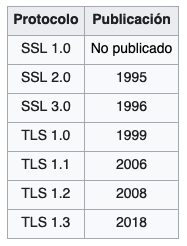
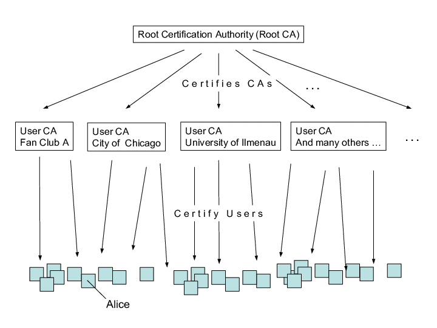

<style>
    /* You can add custom style here. VSCode supports this.
    Other editor might need these custom code in
    the YAML header: section: | */
	/* section header { display: none; } */
	/* section footer { display: none; } */
</style>

# Criptografía
<!-- _class: first-slide -->

**Tema 9: protocolos**

Juan Vera del Campo - <juan.vera@campusviu.es>

# Qué sabemos hacer

- Sabemos enviar mensajes con confidencialidad: criptografía simétrica
    - [Tema 3](03-simetrica.html): AES, ChaCha20
- Sabemos acordar una clave con alguien a quien no conocíamos:
    - [Tema 4](04-complejidad.html): Diffie-Hellman
- Sabemos ofrecer integridad: hash y después cifrado con criptografía asimétrica
    - [Tema 5](05-asimetrica.html): RSA
    - [Tema 6](06-hashes.html): resumen de mensajes, hashes
    - [Tema 7](07-integridad.html): integridad de mensajes
- Sabemos autenticar: claves públicas y sistemas de confianza
    - [Tema 8](08-pki.html): PKI

¿Cómo juntamos todo esto?

# Transport Layer Security
<!-- _class: lead -->

## Transport Layer Security

Seguridad de la capa de transporte (en inglés: *Transport Layer Security* o TLS) y su antecesor Secure Sockets Layer (*Secure Socket Layer*) son protocolos criptográficos que proporcionan:

- Autenticación mediante certificados. Es decir: criptografía asimétrica.
- Gestión de claves. Es decir: protocolo Diffie-Hellman
- Confidencialidad de las comunicaciones. Es decir: criptografía simétrica




>  [The Transport Layer Security (TLS) Protocol Version 1.3, RFC8446 2018](https://tools.ietf.org/html/rfc8446)

<!--
El antecesar de TLS es SSL, que era igual en la práctica pero con colecciones de cifrado y gestión ligeramente diferente. Aunque el protocolo que usamos es TLS, aún es común referirnos a este protocolo como TLS.
-->

---
<!-- _class: with-warning -->

**TLS es el protocolo utilizado en cualquier conexión a Internet**


- La "s" de "https" es para pedir que se use TLS
- El "candado" de los navegadores indica que se está usando TLS
- Si pulsas en el escudo verás las propiedades de esta conexión TLS

En la web actual, deberemos desconfiar de cualquier página o servicio que no tenga candado. Es decir, que no use TLS

---


> https://hpbn.co/transport-layer-security-tls/

<!--
TLS se pone entre TCP y HTTP, como una capa adicional: ni TCP ni HTTP "saben" que está ahí.

Es decir, las peticiones son peticiones HTTP estándar, que viajan sobre TCP estándar. Pero entre medias estas peticiones crean una sesión inicial y se cifran.
-->

## Propiedades de seguridad

Funcionalmente equivalente a un socket TCP aportándole:

- Autenticidad: Clave pública
    - autenticación mutua: cliente y servidor tienen certificado
    - autenticación de servidor: solo el servidor tiene un certificado
- integridad: HMAC/MAC
- confidencialidad:
    - acuerdo de claves
    - cifrado simétrico

<!--
A veces no da tiempo a ver qué es MAC/HMAC en este curso: es un hash cifrado con una clave simétrica que asegura que un mensaje no ha cambiado durante la transmisión. La idea es similar a una firma digital: cifrado (con clave simétrica) del hash del mensaje. Pero las implicaciones tanto legales como operativas son diferentes: no garantiza autenticidad pero es mucho más rápido.
-->

## Autenticación

TLS tiene dos modos para garantizar la autenticación de las partes:

- **Autenticación mútua**: cliente y servidor tienen certificado. El cliente sabe que está hablando con su banco, y el banco que está hablando con su cliente.
- **Autenticación de servidor**: solo el servidor tiene un certificado. El cliente sabe que está hablando con el banco, pero **el banco no sabe nada del cliente**

Utilizar TLS solo con autenticación de servidor es lo más habitual en Internet

## Autenticación: gestión de la identidad

- Servidor: clave privada habitualmente en fichero en claro protegido únicamente por el SO (ACL) o en HSM con activación automática
- Cliente:
    - sin autenticación de cliente: anónimo, usuario y contraseña, etc.
    - con autenticación de cliente: fichero PKCS #12, o accediendo a un HSM en forma de SmartCard o de token USB vía librería PKCS #11


---

Lo más habitual en Internet es utilizar TLS con solo autenticación de servidor

**Las páginas web tienen que autenticar al visitante**

- Usuario y contraseñas
- Sistemas Cl@ve, firma electrónica en momentos puntuales, 2FA...

Más información en el [Tema 7](07-autenticacion.html)

## Acuerdos de los parámetros de la conexión

Los clientes cuando se conectan acuerdan utilizar la versión más moderna que soporten ambos extremos:

- SSL 3.0: obsoleto
- TLS 1.0/1.1: fin de vida en 2020
- TLS 1.2: versión recomendada
- TLS 1.3: publicada en 2018; fuerza a utilizar DHE/ECDHE para acuerdo de claves

<!--
Poder escoger los parámetros de conexión es un arma de doble filo: el pasado, algunos atacantes forzaban a los clientes a utilizar versiones antiguas y débiles de los protocolos

Los servidores pueden exigir a sus clientes utilizar solo versiones actualizadas de todos los protocolos
-->

---


> Fuente: wikipedia

## Cipher Suites

Prococolos que describen las conexión:

Se identifican (aprox) con la cadena `KEA_SIGN_WITH_CIPHER_HASH`

Componente|Contenido
--|--
KEA|Algoritmo de acuerdo de claves
SIGN|Algoritmo de firma
CIPHER|Algoritmo de cifrado simétrico
HASH|Algoritmo de hash

## Algoritmos en TLS v1.3

los siguientes cipher-suites son de obligada implementación (*MUST*):

- `{DHE|ECDHE}_ECDSA_WITH_AES_128_GCM_SHA256`
- `{DHE|ECDHE}_RSA_WITH_AES_128_GCM_SHA256`

y se recomienda la implementación de estos (*SHOULD*):

- `{DHE|ECDHE}_ECDSA_WITH_AES_256_GCM_SHA384`
- `{DHE|ECDHE}_ECDSA_WITH_CHACHA20_POLY1305_SHA256`
- `{DHE|ECDHE}_RSA_WITH_AES_256_GCM_SHA384`
- `{DHE|ECDHE}_RSA_WITH_CHACHA20_POLY1305_SHA256`

---

- claves de sesión establecidas por acuerdo de claves (PFS)
- DH-2048, ECDH-256, X25519: longitudes mínimas para acuerdo de claves
- RSA-2048, ECDSA-256, EdDSA25519: longitudes mínimas para firma
- desaparecen DSA, SHA-1, SHA-224, 3DES


---


## Inicialización (caso general, PFS)

A partir de los dos *InputSecret* se genera el *MasterSecret*, del que se derivan 4 claves y 2 vectores de inicialización (IV, recuerda Tema 3):

- clave de cifrado de cliente a servidor (y viceversa)
- IV, para el cifrado de cliente a servidor (y viceversa)
- clave HMAC de cliente a servidor (y viceversa)

PFS: Perfect Forward Secrecy

<!--

Seguridad "a futuro": Perfect Forward Secrecy

Un ataque que revele una clave privada implica que se debe cambiar la clave privada

pero si no se usa _DHE_ ó _ECDHE_ el revelado de la clave privada permite el descifrado de tráfico pasado

-->


## Inicialización (caso sin PFS)

En el caso de no usar DHE (ni ECDHE) el cliente debe enviar el MasterSecret al servidor cifrándolo con la clave del servidor:

MasterSecret: PBKservidor(MasterSecretcliente)

En este caso (no-PFS) una revelación de la clave privada del servidor en cualquier momento, permite descifrar el tráfico futuro y también el tráfico pasado. Con PFS esto no sucede ya que las claves de efímeras (EDH ó ECDHE) cambian en cada acuerdo y no se almacenan nunca

## Transporte

los datos se fragmentan en bloques de hasta 16 kB

cada bloque está protegido por algoritmos simétricos acordados durante la inicialización y las claves y IV's derivados de la MasterKey...

y por un número de secuencia


# Seguridad

- Algoritmos: TLS hasta la versión v1.2 permite configurar algoritmos (cipher suites) que actualmente son obsoletos
- Protocolo: versiones antiguas, mecanismos de renegociación (para bajar a versiones antiguas)…
- Implementaciones: limitación de parámetros, uso de PRNG de baja calidad
- Condiciones de uso: gestión del servidor (o el cliente)


## Seguridad: Algoritmos

TLS hasta la versión v1.2 permite configurar algoritmos obsoletos (v1.3 lo impide pero su publicación es muy reciente como para que todos los componentes lo hayan adoptado)

TLS hasta la versión v1.2 renegocia el mejor protocolo entre cliente y servidor. Un cliente "antiguo" puede forzar a usar o bien un cipher suite obsoleto o bien no dejarlo conectar

## Seguridad: Algoritmos (TLS v1.3)

En la versión v1.3 se han eliminado cualquier algoritmo que resulte en un cipher-suite inseguro, facilitando la configuración segura de los servidores

Eliminados NULL, ANON, sin acuerdo de claves, con acuerdo de claves no efímero, SHA-1, 3DES, DSS (DSA)

Se debe vigilar que RSA y DHE sean de 2048 bit o más, y que ECDSA y ECDH usen P-256, P-384, P-521, Curve25519 ó Curve448


## Seguridad: condiciones de uso

- claves protegidas (sólo) por el S.O.
- las claves en claro están expuestas (ataques, aparición en backups, scripts de despliegue)
- (históricamente) los certificados han sido caros (…)
- (actualmente) deben regenerarse frecuentemente (certificados de corta duración)

# Prácticas
<!-- _class: lead -->

## Creación de una CA



## Creación de CA

Simplificado de https://jamielinux.com/docs/openssl-certificate-authority/create-the-root-pair.html

```bash
mkdir -p private
mkdir -p certs
# Genera clave privada para la CA
openssl genrsa -aes256 -out private/ca.key.pem 4096
# Genera certificado público para la CA
openssl req -key private/ca.key.pem -new -x509 -days 7300 -sha256 -out certs/ca.cert.pem
# Muestra el certificado por pantalla
openssl x509 -noout -text -in certs/ca.cert.pem
```

## Creación de nuevo certificado de usuario

Esto lo ejecuta cualquier en su casa:

```bash
# Genera par de claves para www.example.com
openssl genrsa -out private/www.example.com.key.pem 2048
# Genera par de claves para www.example.com, protegido por contraseña
# openssl genrsa -aes256 -out private/www.example.com.key.pem 2048

# Genera petición de firmado. Esta es la petición que le enviamos a la CA
openssl req -key private/www.example.com.key.pem -new -sha256 -out csr/www.example.com.csr.pem
```

- Guardamos: `private/www.example.com.key.pem` Este arhchivo incluye nuestras claves pública y privada
- Enviamos a CA: `csr/www.example.com.csr.pem` Este archivo incluye nuestra clave pública

---

Una CA obtiene el archivo `csr`, comprueba nuestra identidad de alguna manera (presencial, DNI, DNS...) y ejecuta:

```bash
# La CA firma la petición y devuelve el certificado
openssl x509 -signkey private/ca.key.pem -in csr/www.example.com.csr.pem -req -days 365 -out certs/www.example.com.cert.pem
openssl x509 -noout -text -in certs/www.example.com.cert.pem
```

- Guardamos: `certs/www.example.com.cert.pem` Este archivo incluye nuestra clave pública y es lo que podemos darle a cualquier persona


## Let's encrypt

Proyecto de la EFF: ofrecer certificados a cualquier persona **con un servidor publico** (es decir, accesible desde Internet)

Antes, los certificados se compraban

"Desventaja": hay que renovarlos cada 3 meses, aunque el proceso puede automatizarse

<https://certbot.eff.org/instructions>

# Conclusiones
<!-- _class: lead -->

## Resumen

- TLS es el protocolo "que lo combina todo": confidencialidad, autenticación, acuerdo de claves, integridad...
- Se basa en que existe un sistema de PKI funcional en Internet
- La seguridad de Internet está basada en la confianza que tenemos en la distribución de certificados, es decir, en la distribución de claves públicas de los servidores

## Referencias

- [Transport Layer Security, TLS 1.2 and 1.3 (Explained by Example)](https://www.youtube.com/watch?v=AlE5X1NlHgg)
- [SSL/TLS handshake Protocol](https://www.youtube.com/watch?v=sEkw8ZcxtFk)
- [What is TLS (Transport Layer Security)?](https://www.cloudflare.com/learning/ssl/transport-layer-security-tls/)
- [Seguridad en el protocolo SSL-TLS. Ataques criptoanaliticos modernos. Dr. Alfonso Muñoz](https://github.com/mindcrypt/libros/blob/master/Book.%20Seguridad%20en%20el%20protocolo%20SSL-TLS.%20Ataques%20criptoanaliticos%20modernos.%20Dr.%20Alfonso%20Mu%C3%B1oz%20-%2027092020.pdf)

---
<!-- _class: center -->

Continúa en: [Autenticación](10-autenticacion.html)

Anexo recomendable: [Comunicaciones anónimas](A4-anonimato.html)
