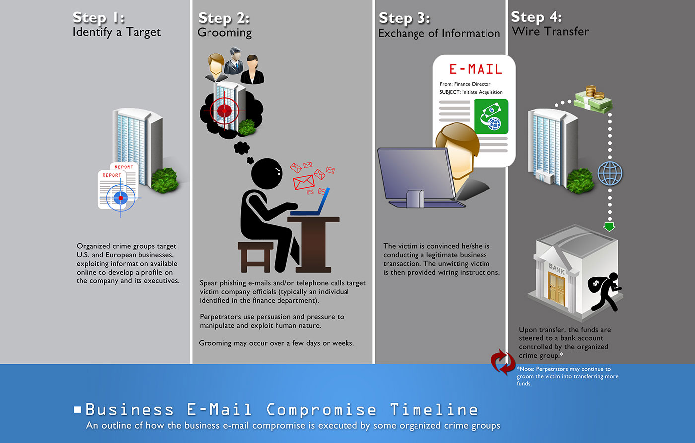
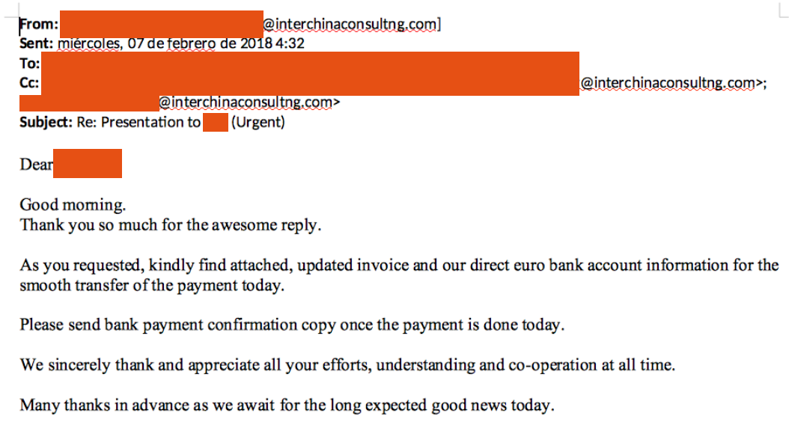
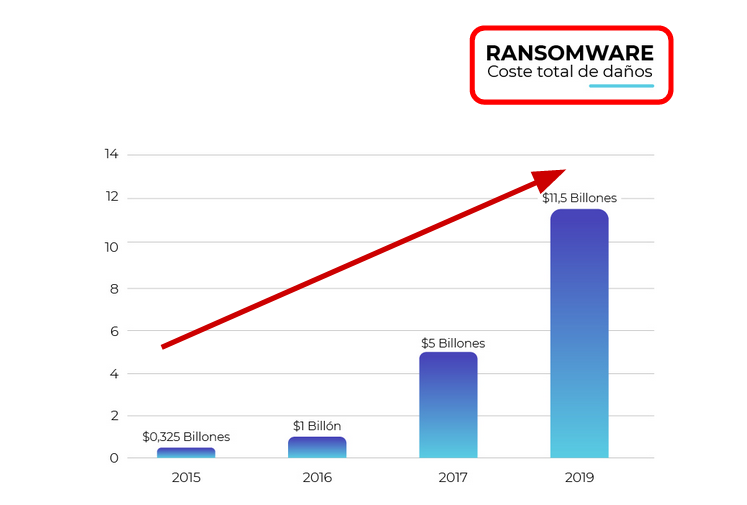
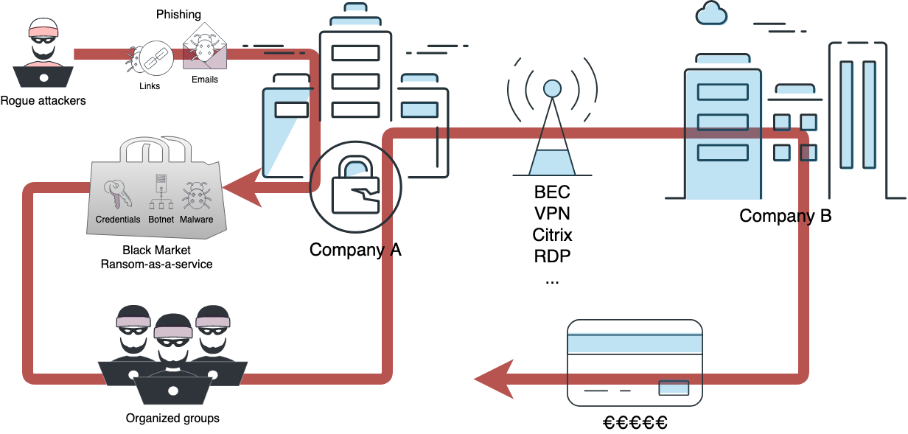
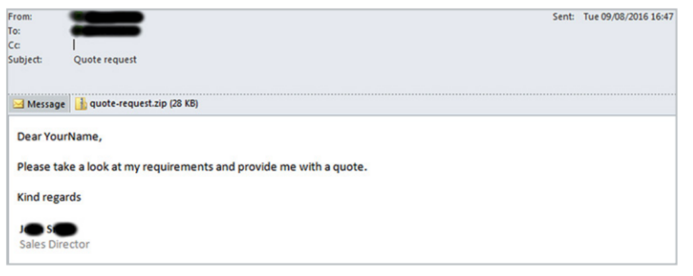

<style>
    /* You can add custom style here. VSCode supports this.
    Other editor might need these custom code in
    the YAML header: section: | */
	/* section header { display: none; } */
	/* section footer { display: none; } */
</style>

# Criptografía
<!-- _class: first-slide -->

**Tema 10: Criptografía como amenaza**

Juan Vera del Campo

juan.vera@campusviu.es

# Hoy hablamos de...

- [Business email compromise (BEC)](#4)
- [Ransomware](#28)
- [Conclusiones](#44): resumen y referencias

# Business email compromise (BEC)
<!-- _class: lead -->

---
<!-- _class: a-story -->


- You work for the finance department of a big company (100MM EUR)
* Your work involves transfering large amounts of money
* One day, you receive a phone call from a layer.

---
<!-- _class: a-story -->


- You can google her name, she is involved in HUGE international operations
* She knows what she is talking about
* "Your company is in the middle of an important and confidential operation. We need your help. The CEO will contact you, please check the email"

---
<!-- _class: a-story -->


Dear employeer,

We are in the middle of a very important finantial operation to acquire one of our competitors. It is of the upmost importance that this operation remains confidential until it can be safely announced.

I will be busy with the details. Please, get in touch with the important lawyer (in copy of this email). Keep me in the email chain.

I hope you undestand the confidentiality and urgency of this operation.

Your boss

---
<!-- _class: a-story -->


- The important lawyer sends you a document with a transfer order for 4M€
* The order is signed by your boss
* You make the transfer
* ...
* A couple of days later, your boss calls you about a unplanned money transfer you made to some unregistered location 

---

Do you believe you would never fall for this?

* ['CEO Spoofing' costs drug company $50 million](https://www.fox9.com/news/ceo-spoofing-costs-drug-company-50-million), 2015
* [Hackers siphon $47 million out of tech company's accounts](https://www.fox9.com/news/ceo-spoofing-costs-drug-company-50-million), 2015
* [Unusual CEO Fraud via Deepfake Audio Steals US$243,000 From UK Company](https://www.trendmicro.com/vinfo/us/security/news/cyber-attacks/unusual-ceo-fraud-via-deepfake-audio-steals-us-243-000-from-u-k-company), 2019
* [Un mail, una llamada y 4 millones robados a la EMT de València que volaron a Hong Kong: así fue el 'fraude del CEO' más salvaje de España ](https://www.eldiario.es/comunitat-valenciana/llamada-fabulosa-millones-emt-valencia_1_1243386.html), 2019
* [Social engineering. CEO fraud of 9 million euros in the phishing scam to the biopharmaceutical company Zendal](https://kymatio.com/en/social-engineering-ceo-fraud-of-9-million-euros-in-the-phishing-scam-to-the-biopharmaceutical-company-zendal/), 2020.
* Most of them are covered up by the companies and never hit the news

---


## Business email compromise (BEC)

- The attacker impersonates a party sending a series of spoofed emails
    - Usually implies previus compromise to gain intelligence
- The first email may be from a legitimate address!
    - ...but not necessarily a legitimate server (check your email client warnings!)
    - `Reply-To` is changed
- Addresses similar to the real ones to disguise themselves
    - `worker@bigcompany.us` instead of `worker@bigcompany.com`
    - `goodworker@bigcompany.com` instead of `good.worker@bigcompany.com`

## BEC: Timeline



---


<!--
Ejemplo de impersonalización: el atacante YA TIENE suficiente información

- El atacante compromete la red de un proveedor y envía el primer correo desde la red del proveedor (o una red que **parece** el proveedor)
- Pero cambia la dirección **de respuesta**, ya sea por la técnica (cabecera "reply to") o por ingeniería social "a partir de ahora las comunicaciones las lleva el abogado X"
- Objetivo: abrir un "hilo de correos" con la víctima que no implique al proveedor
-->

## Process

- The attacker impersonates a party sending a series of spoofed emails
    - Usually implies previous compromise to gain intelligence
- The first email may be from a legitimate address
    - ... but not necessarily a legitimate server (check your email client warnings!)
- Reply-to is changed
- Addresses similar to real ones to distinguish themselves:
    - worker@bigconnpany.com instead of worker@bigcompany.com
    - worker@bigcompany.us instead of worker@bigcompany.com
    - goodworker@bigcompany.com instead of good.worker@bigcompany.com

## Building trust


---


---


---


Beware: these fake extortions **MAY** include personal information collected from public sources!

---


---

The CEO needs something from me!

- “I need help, fast and in confidence”
- “You’ll be contacted by an attorney/an important partner”
- “I can’t be contacted ATM”
Some acting is usually involved. Someone might call you!

---


---



<!--

INCIDE: 101677

Observe: el atacante añade otras direcciones en copia, también controladas por el, para añadir verosimilitud
-->

## PGP

The perfect solution: sender signs the email, the receiver only accept emails from trusted parties


Bad news: PGP is not used in real life!

## SPF

Check the sender is authorized to send emails from that server


> https://medium.com/@pendraggon87/short-primer-on-spf-dkim-and-dmarc-9827eb2f359d

## DKIM: DomainKeys Identified Mail

Check the digital signature of the sender **server**


> Fuente: https://dmarcian.es/what-is-dkim/

---

```
DKIM-Signature: v=1; a=rsa-sha256; c=relaxed/relaxed;
        d=campusviu-es.20150623.gappssmtp.com; s=20150623;
        h=mime-version:from:date:message-id:subject:to;
        bh=s7gErmNKwESPKSP6VW9kvRoEY/oQ8b6V1OFgRMqAjtU=;
        b=pkvh0yCIRyEAMsbqmkKn6YJH+0LvTdZR99sg7D5ftMNF+uSKiDe33MnPbfM2IDXAhL
         8Zx3svceJ+8EtJ1zc5vUSsZcwE22npWHCY63SlXnBt2OlZ3dOGeLrMmO7RQO8Ed907wc
         9MbtzwaQsQR5jfkxK6tu9pzNO4QLr3PsIxq2MfdRmoGqwqazkcG/qSRExH9dwVFyjDt2
         DJPxG6Zc1Z0v5HMxxPvbYfhyyJx9wjtT+pEFL/K17NutjL3Ck4s5N5eFRDyspw38gxwo
         JIzqfwys5b8r1jv82Ufcw9C3lz6ofanTg1d1GMbLxDtaYdfyt4CDxZjSQTH2roLJ+X5y
         HCvg==
X-Google-DKIM-Signature: v=1; a=rsa-sha256; c=relaxed/relaxed;
        d=1e100.net; s=20161025;
        h=x-gm-message-state:mime-version:from:date:message-id:subject:to;
        bh=s7gErmNKwESPKSP6VW9kvRoEY/oQ8b6V1OFgRMqAjtU=;
        b=lB+wgPGej/d1HNLxj7oP1L9Mi56hwji5GA3hLrVYCRKohiAs3L7uI6fEq7sp7wBXKm
         9mOGnbIrSXMeOfOa/YnAnJg/4x6U5gvVtoisigFMR/bGxoPQRO6LUqvunBhR3il6f+OX
         ZRJIsZsvigsesD1vZcarlVr5D0QL2Cw2l1o1T6zVNH3Z8cmZNTCpfzmD3YmVCm+Cgdz9
         RQgX/iL12TxzzOmx+8yInGYnL9ZyaNY6Wsbi7LOBp7kRNLWrMKVtUlwuS2WSzQ5Jvwkm
         0SZ90S524hBquiF8WAzJI95AD/L5fr69sjaN/wM6pk8l6fTapm8+K6TsMPYrEhHtRFZ2
         vLYQ==
```

# The bad news...

- PGP is rarely used in real life... unfortunately
- Not all companies implement SPF or DKIM
- These mechanisms do not protect against an email sent from `macdonalds.com`: the attackers can configure SPF and DKIM too!

## Recommendations

- Check the address of the other participant in the communication
- Be careful if the address changes
- Be careful if the language of the other participants change
- Many email clients do alert when an address changes
- Many email clients do alert if an Internet header is spoofed

# Ransomware
<!-- _class: lead -->

---


---



---


## Ransomware-as-a-service



---


---


> https://www.coveware.com/blog/ransomware-marketplace-report-q4-2020

## Ransomware as an unplanned backup


---


> Check: https://www.ransomwatch.org/

## Entry point


---



## Example: Babuk

Modern Ransomware and exfiltration

- First, it kills security services: antivirus, backup services...
- Next, it **removes** existing backups and shadow copies
- It uses its own implementation of SHA256 hashing, ChaCha8 encryption, and Elliptic-curve Diffie–Hellman (ECDH) key generation and exchange algorithm to protect its keys and encrypt files

---

1. Babuk uses RtlGenRandom to generate 4 random buffers. Two of which are used as ChaCha8 keys, and the other two are used as ChaCha8 nonces.
1. It will encrypt the second ChaCha8 key using the first key and nonce. After that, the first key is then encrypted using the encrypted second key and nonce.
1. This encrypted first key is treated as the Elliptic-curve Diffie–Hellman (ECDH) private key for the local machine.
1. It generates a shared secret using the local private key and the author’s hard-coded public key.
1. This shared secret goes thorugh a SHA256 hashing algorithm to generate 2 ChaCha8 keys, which are used to encrypt files later.
1. In order to be able to decrypt files, Babuk stores the local public key in the file `ecdh_pub_k.bin` in the APPDATA folder.

---

1. Using FindFirstFileW and FindNextFileW calls, it goes through each directory to look for files and sub-directories.
1. Babuk only goes down 16 directory layers deep, so it potentially does not encrypt every single folders in the drive to save time.
1. For small files that are les than 41943040 bytes or roughly 41 MB in size, the file is mapped entirely and encrypted with ChaCha8 two times.
1. With large files, encryption is a bit different. To save time, the entire file is divided into three equally-large regions. For each of these regions, only the first 10485760 bytes or 10 MB will be encrypted.
1. Babuk uses the two ChaCha8 keys generated from the ECDH shared secret’s SHA256 hash as the encrypting keys and the first 12 bytes of the shared secret as nonce.

---


## Recommendations

- Ransomware uses state-of-the-art encryption mechanisms: files cannot be decrypted without contacting paying the attacker
- Backup your files
- Do not store the backup in the same machine or it will be encrypted as well!
- After a ransomware event, check carefully the attacker is not still inside!

# Referencias

- [Credit Card Scammers in the Dark Web](https://www.youtube.com/watch?v=jT-jmq8KBw0)
- [Be aware - how hackers can steal your money](https://www.youtube.com/watch?v=h8-27iLvyS4)
- [Spying on the scammers](https://www.youtube.com/watch?v=le71yVPh4uk)
- [Babuk Ransomware, by McAfee](https://www.mcafee.com/blogs/other-blogs/mcafee-labs/babuk-ransomware/)
- [Babuk Ransomware, by ChuongDong](http://chuongdong.com/reverse%20engineering/2021/01/03/BabukRansomware/)

---
<!-- _class: center -->

Continúa en: [Comunicaciones anónimas](11-anonimato.html)