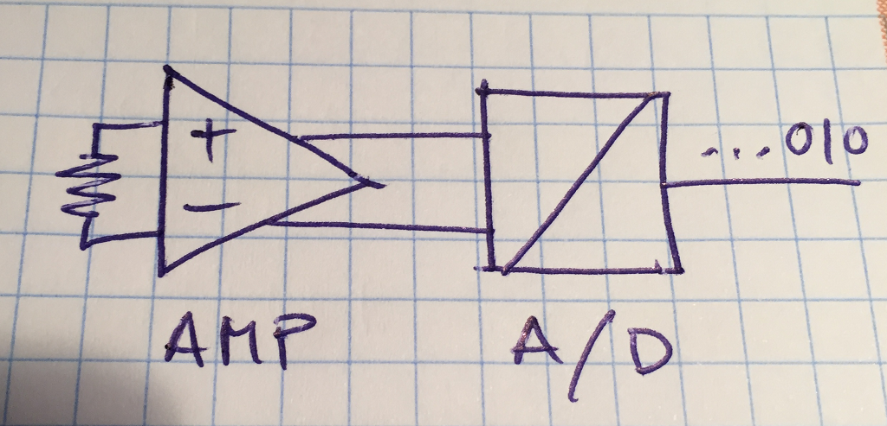
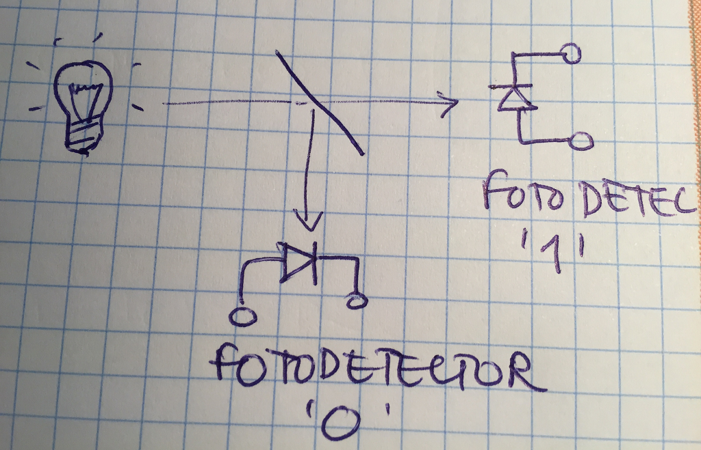
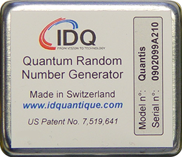
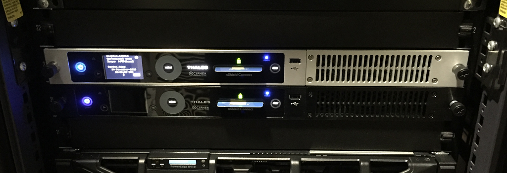

# Criptografía y teoría de códigos
<!-- _class: first-slide -->

**Anexo: Generación de números aleatorios**

Juan Vera del Campo

<juan.vera@campusviu.es>

# Contenido
<!-- _class: cool-list -->

1. [True Random Number Generator](#3)
1. [Dispositivos ad-hoc para RNG](#10)
1. [Hardware Secure Module](#16)

# RNG
<!-- _class: lead -->

*ó TRNG (True Random Number Generator)*

## Utilidad

Muchos algoritmos criptográficos necesitan generar números realmente aleatorios.

- *nonces*
- *Vectores de inicialización*
- *claves*

La generación de números totalmente aleatorios (RNG) no se puede implementar con un algoritmo: los algoritmos son precedibles

## Generación

¿Cómo implementamos un RNG si no es algorítmico?

- Recopilando eventos de entrada (I/O) y acumulando sus parámetros en un proceso llamado "reducción"
- Mediante dispositivos especializados: HSM (*Hardware Secure Module*)

<!-- La reducción de parámetros implica reducir el ancho de banda: generar
números aleatorios es lento porque hay que esperar a tener datos de UI -->

## Fuentes de aletoriedad I/0

Necesitamos **ruido**

- UI (ratón, teclado...): <<1kbps después de reducción
- latencia disco duro: <<1 kbps después de reducción
- red: 1 kbps después de reducción
- funciones de procesador. Intel: varios Mbps

Esto limita la velocidad de cifrado: no podemos cifrar más rápido que la generación de números aleatorios

## Validación

Los RNG (y PRNG) deben tener unas propiedades para las secuencias generadas:

**La secuencia de números (o de bits) debe tener una distribución uniforme a todos los niveles**

- Bit a bit: el 0 y el 1 tienen que aparecer con probabilidad 0.5
- Por grupos de bits: el 00, el 01, el 10 y el 11 deben aparecer con probabilidad 0.25
- Y así

Para $n$ bits generados, la probabilidad de una secuencia dada es la misma de la de cualquier otra: $2^{−n}$

> Adicional: [Verifying randomness](https://www.incibe-cert.es/en/blog/verifying-randomness) y también [Cryptographic Algorithm Validation Program](https://csrc.nist.gov/projects/cryptographic-algorithm-validation-program/random-number-generators)

## Vulnerabilidades

- [Random number generator attack](https://en.wikipedia.org/wiki/Random_number_generator_attack)
- [Random Number Bug in Debian Linux](https://www.schneier.com/blog/archives/2008/05/random_number_b.html)
- [Hackers obtain PS3 private cryptography key due to epic programming fail](https://www.engadget.com/2010-12-29-hackers-obtain-ps3-private-cryptography-key-due-to-epic-programm.html?guce_referrer=aHR0cHM6Ly9qaWcuZ2l0aHViLmlvL2NyeXB0by9lcy9oc20uaHRtbA&guce_referrer_sig=AQAAAKXwkpkCNqfEaVw1yS3NK2tZmvzXMxfMX_8BWvxdm_EUJrBQiB2kWlvwNcwNwF2zt1hpN7NT7QfzQlleivOoPO2rB36OxlE27B5YT9Po_njXAv0RocpOJcTS53xIYCdwCKKoh8nKkw_VSOBvmIEQiebNsCgqTK0P3AgklvlogU1G)
- [Kaspersky Password Manager: All your passwords are belong to us](https://donjon.ledger.com/kaspersky-password-manager/): hasta abril de 2021, usaban una fuente no criptográfica para generar contraseñas. Con conocimiento adecuado, las contraseñas podían adivinarse "en segundos". ([CVE-2020-27020](https://cve.mitre.org/cgi-bin/cvename.cgi?name=CVE-2020-27020))

La criptografía es segura siempre que las hipótesis de funcionamiento se cumplan, y una de ellas es que **se está generando números aleatorios con una fuente RNG ó PRNG criptográfica**

## Generación de claves

¿Para generar claves hemos de utilizar PRNG o RNG? Mejor RNG pero si no está disponible podemos usar PRNG a condición que:

- el PRNG se alimente de una semilla RNG
- que el PRNG sea de calidad criptográfica (AES-CTR por ejemplo)
- que la semilla tenga suficiente entropía para cubrir el nivel de seguridad requerido (i.e. 128b)
- y que se mantengan las hipótesis de seguridad: no reutilizar bajo ningún concepto una secuencia de bits (ya sea RNG ó PRNG)

> Fuente: [NIST: Recommendation for Key Management: Part 1 Rev. 5](https://csrc.nist.gov/publications/detail/sp/800-57-part-1/rev-5/final) (2020)

 # Dispositivos ad-hoc para RNG
 <!-- _class: lead -->

 Usados en HSM, SmartCards, algunas CPUs...

 ## Ruido térmico

 

 Una resistencia a temperatura ambiente tiene electrones libres que se mueven aleatoriamente (carga negativa) y podemos medir el desequilibrio momentáneo con un conversor Analógico/Digital

El conversor dará una secuencia indefinida de bits aleatorios

## Generador cuántico
<!-- _class: center -->

 

Con una fuente de luz apuntamos a un espejo semireflectante; dos fotodetectores detectan uno u otro el fotón de forma totalmente aleatoria

## Uniformidad

Ambas fuentes de ruido generan valores aleatorios **pero no uniformes**

- RNG térmico: limitado por el ancho de banda (señal)
- RNG cuántico: limitado por la precisión del espejo (semireflectancia del 50% exacta)

## Reducción

- Se descartan las secuencias seguidas de '1' y de '0' y sólo se genera un bit random en los cambios. Por ejemplo:
    - El cambio de 000001xxxx genera un 1
    - El cambio 111110xxxxx genera un 0
- Esto reduce los bps pero uniformiza la secuencia
- se aplica una PRF/PRP sobre el flujo anterior. Por ejemplo las CPU's Intel cifran la secuencia con AES-128 y la clave 0x00...000

## Fuentes Random en Linux

En Linux (Ubuntu) tenemos dos fuentes random:

- `/dev/random`: salida RNG basada en I/O. Flujo lento en el rango de bps
- `/dev/urandom`: unblocking random, salida PRNG (ChaCha20) enriquecida con `/dev/random`. Flujo en el rango de Mbps

En otros Linux tenemos diferentes combinaciones de `/dev/random` y con aleatoriedad obtenida de diferentes fuentes

<!-- En Linux, casi siempre os interesará leer de urandom: leer de random es muy lento y puede bloquearse, esperando a tener suficientes eventos -->

# HSM
<!-- _class: lead -->

Hardware Secure Module

## Funciones de un HSM

las funciones de un HSM son:

- generar claves "de calidad"
- custodiarlas de forma segura
- protegerlas contra uso ilegítimo
- asegurar su correcto uso
- secundarias: velocidad, volumen, portabilidad, clave compartida...

## HSM portable

## HSM embedido

## HSM servicio en red

## Requisitos

Para implementar las funciones anteriores hace falta:

- generador de claves aleatories (RNG)
- uso controlado verificable
    - protección física (no se puede leer el sistema de ficheros, o modificar el software sin "estropear" el HSM)
    - protección software (API con control de acceso)
- área de ataque mínima (API "minimalista", hace más improbable los bugs o los security flaws)

## FIPS 140-2

Los HSM pueden ser certificados según [FIPS 140-2](https://csrc.nist.gov/publications/detail/fips/140/2/final) en diferentes niveles:

*The security requirements cover areas related to the secure design and implementation of a cryptographic module. These areas include cryptographic module specification; cryptographic module ports and interfaces; roles, services, and authentication; finite state model; physical security; operational environment; cryptographic key management; electromagnetic interference/electromagnetic compatibility (EMI/EMC); self-tests; design assurance; and mitigation of other attacks.*

---

- FIPS 140-2 nivel 1: sin contramedidas físicas (son librerías); análisis lógico y de algoritmos
- FIPS 140-2 nivel 2: nivel 1, y debe disponer de contramedidas pasivas para detectar el acceso físico (sellos, evidencias)
- FIPS 140-2 nivel 3: nivel 2, y debe disponer de contramedidas activas para contrarrestar el acceso físico (ceroización) y sólo permite exportar las claves cifradas
- FIPS 140-2 nivel 4: nivel 3, y debe disponer de validación formal del funcionamento

---

para gestionar claves de usuarios para firma avanzada : FIPS 140-2 nivel 2

para autoridades de validación o de sello de tiempo : FIPS 140-2 nivel 2

para autoridades de certificación :  FIPS 140-2 nivel 3

## PKCS #11

[PKCS #11](http://docs.oasis-open.org/pkcs11/pkcs11-base/v2.40/os/pkcs11-base-v2.40-os.html) es una especificación de la API de los HSM en lenguaje C (literalmente un .h)

PKCS: Public Key Cryptographic Standard. Estándares de facto publicados por RSA Labs. Inc. (ahora EMC2 (ahora Dell Technologies)); actualmente la gestión del estándar ha pasado a OASIS

##  PKCS #11: operaciones

- login, gestión de sesión
- generación de claves simétricas/asimétricas
- cifrado/descifrado simétrica
- firma/verificación simétrica
- descifrado/firma asimétrica
- operaciones para acuerdo de claves (TLS)
- RNG
- des/ensobrado de claves (key un/wrap)
- gestión de objetos

## Partición de Secretos

En claves importantes (e.g. la de una CA raíz) un HSM puede no ser suficiente (¿y si lo roban?)

En estos casos podemos dividir la clave en trozos:

- Dividir la cadena de bits en trozos disminuye la seguridad: si el atacante adquiere una parte, tiene que adivinar menos bits de la otra.
- $\otimes$ entre las claves: seguro incondicionalmente, pero frágil (la clave se pierde si se pierde una parte)
- [Algoritmo de Shamir](https://en.wikipedia.org/wiki/Shamir's_Secret_Sharing): seguro incondicionalmente y robusto. Permite recuperar la clave si se dispone de al menos M de los N trozos.

---

¿Lo podemos hacer "por software"?

Sí, pero el secreto ha estado "en claro" en la RAM del ordenador por tanto una vez recuperado el secreto su exposición ha aumentado notablemente

Pero en HSM es una propiedad habitual

---
<!-- _class: last-slide -->
